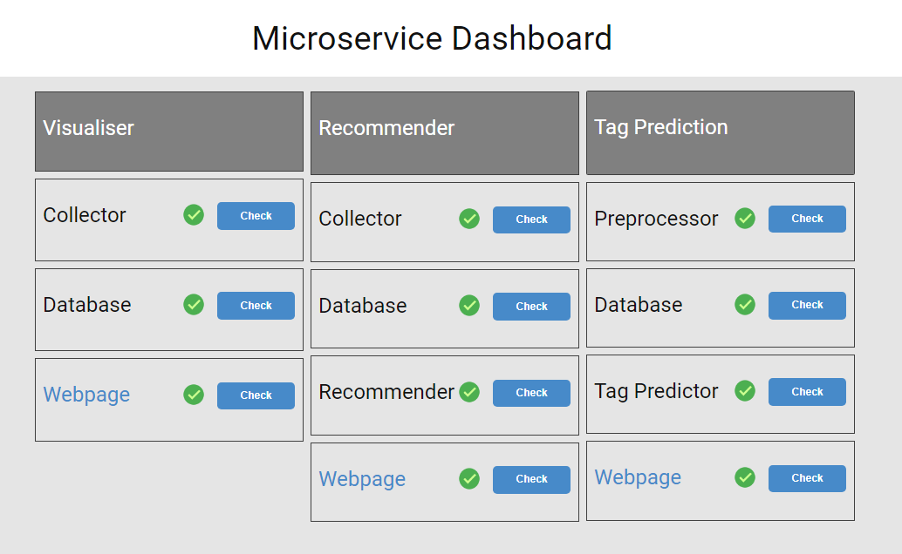

# Big Data Microservices




Instructions:
- To clone the respository:
    - Pull using: ``` git clone --recursive https://github.com/iamitaliya/big_data_microservices.git  ```

- To commit changes:
    - Go the the main folder of that particular submodule
    - Publish changes (The changes will be published to that particular repository)
    - Go to main folder of this repository (e.g. ``` cd .. ```)
    - Publish changes (The changes will be published to this repository with updated reference to that submodule)

- To run all the microservices:
    - ``` docker-compose up -d ```
    - The status of individual microservices can be viewed on ```localhost:5555```